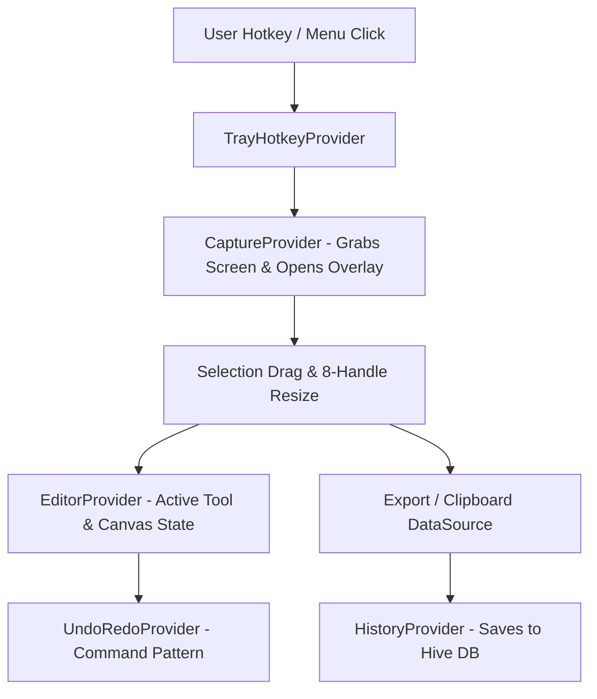

# SnapMark — Development Plan & Master Prompt Guide

> **Document Type:** Development Master Plan & Execution Prompts  
> **Application:** SnapMark — Lightweight Desktop Screenshot & Annotation Tool  
> **Inspiration & UX Flow:** Lightshot-Style Fast Flow (Menu Bar Tray + Dual Selection Toolbars)  
> **Target Platforms:** macOS, Windows, Linux (Flutter Desktop)  
> **Architecture:** Clean Architecture + Feature-First  
> **State Management:** `Provider` (`ChangeNotifier`, `MultiProvider`, `Consumer`)  
> **Operation Mode:** 100% Offline-First (Zero cloud dependency, all local storage)  
> **Design Philosophy:** Minimalist, Pixel-Perfect, High-Performance, Dark & Light Mode  

---

## 1. Product Vision & User Experience Flow (Lightshot-Style)

SnapMark replicates and enhances the industry-standard **Lightshot workflow**:

```
[System Menu Bar / Tray Icon] 
        │ (Click "Take Screenshot" or press Global Hotkey ⇧⌘9 / PrtSc)
        ▼
[Instant Screen Freeze & Fullscreen Dimmed Overlay]
        │ (Mouse Drag to select region)
        ▼
[Selected Box with 8 Resize Handles + Live WxH Dimension Badge]
        ├───▶ [Right Vertical Toolbar] : Annotation Tools (Pen, Line, Arrow, Rect, Circle, Marker, Text, Blur, Number, Color, Undo)
        └───▶ [Bottom Horizontal Toolbar]: Actions (Copy, Save, Pin, Quick History, Cancel)
```

### 1.1 Step-by-Step Interaction Flow
1. **Menu Bar / System Tray Launch**:
   - App starts quietly in background and sits in the macOS Menu Bar (top bar) or Windows System Tray.
   - Clicking the icon shows a sleek popup menu:
     - 📸 **Take screenshot** (`Shift + Cmd + 9` / `Ctrl + Shift + A`)
     - 🕒 **History / Recent Captures**
     - ⚙️ **Preferences...**
     - ℹ️ **About SnapMark**
     - 🚪 **Quit SnapMark**
2. **Instant Capture Overlay Trigger**:
   - Clicking "Take screenshot" or pressing the global hotkey immediately freezes the desktop into a fullscreen dimmed overlay (`Color(0x66000000)`).
3. **Region Drag Selection**:
   - Crosshair cursor allows drawing a custom bounding box.
   - Top-left displays live pixel dimension badge: `[ 452x345 ]`.
   - Selection has a clean dashed/solid border with **8 precision resize handles** (corners & edge centers).
4. **Dual Floating Toolbars (Attached to Selection)**:
   - **Right Vertical Toolbar**: Annotation tools docked right against the selection edge.
   - **Bottom Horizontal Toolbar**: Action buttons docked right below the bottom edge.
   - *Smart Edge Flip*: If selection touches screen boundaries, toolbars automatically flip inside or to opposite sides so they never go off-screen.
5. **Instant Copy / Save**:
   - Clicking **Copy** (`Ctrl/Cmd + C`) immediately puts PNG into system clipboard and closes overlay.
   - Clicking **Save** (`Ctrl/Cmd + S`) saves locally and opens notification.
   - Pressing **Esc** or clicking **X** immediately dismisses overlay.

---

## 2. Recommended Dependencies (`pubspec.yaml`)

```yaml
name: snapmark
description: Offline-first Desktop Screenshot & Annotation Application.
version: 1.0.0+1

environment:
  sdk: '>=3.2.0 <4.0.0'
  flutter: ">=3.16.0"

dependencies:
  flutter:
    sdk: flutter
  flutter_localizations:
    sdk: flutter

  # State Management
  provider: ^6.1.2

  # Desktop Window, Screen Capture & Tray Management
  window_manager: ^0.3.9
  screen_retriever: ^0.1.9
  tray_manager: ^0.2.3
  hotkey_manager: ^0.1.8

  # Graphics & Image Processing
  image: ^4.2.0
  path_provider: ^2.1.3
  path: ^1.9.0
  pasteboard: ^0.2.0

  # Offline Local Storage (Zero Cloud)
  hive: ^2.2.3
  hive_flutter: ^1.1.0
  shared_preferences: ^2.2.3

  # Utilities
  uuid: ^4.4.0
  intl: ^0.19.0
  file_picker: ^8.0.0
  flutter_colorpicker: ^1.1.0

dev_dependencies:
  flutter_test:
    sdk: flutter
  flutter_lints: ^3.0.0
  hive_generator: ^2.0.1
  build_runner: ^2.4.9
```

---

## 3. Clean Architecture & Feature-First Directory Structure

```text
lib/
│
├── main.dart                          # App bootstrap, Tray init, Hive setup, Window config
├── app/
│   ├── app.dart                       # MaterialApp & Global MultiProvider setup
│   ├── routes.dart                    # Route definitions (Overlay, History, Settings, Pin)
│   └── theme/
│       ├── app_colors.dart            # Minimal dark/light tokens & toolbar palettes
│       ├── app_theme.dart             # Desktop ThemeData (crisp borders, flat buttons)
│       └── app_typography.dart        # Clean typography (Inter / System UI font)
│
├── core/
│   ├── constants/
│   │   ├── app_constants.dart         # Default hotkeys, max history size, handle radius
│   │   └── asset_constants.dart       # SVG icons for Tray, Pen, Arrow, Shapes, Copy, Save
│   ├── errors/
│   │   ├── failures.dart              # CaptureFailure, StorageFailure, HotkeyFailure
│   │   └── exceptions.dart
│   ├── extensions/
│   │   ├── context_extensions.dart    # Theme, media query, provider shortcuts
│   │   ├── rect_extensions.dart       # Toolbar positioning math, collision, flipping
│   │   └── color_extensions.dart
│   ├── platform/
│   │   ├── screen_capture_service.dart # Multi-monitor screenshot bitmap bridge
│   │   ├── window_controller.dart     # Borderless transparent overlay & tray window manager
│   │   ├── global_hotkey_service.dart # System-wide shortcut listeners
│   │   └── system_tray_service.dart   # Top Menu Bar / System Tray popup menu controller
│   └── utils/
│       ├── file_namer.dart            # Automated format: SnapMark_YYYY-MM-DD_HHmmss.png
│       ├── image_converter.dart       # ui.Image <-> PNG Bytes <-> Pasteboard BMP
│       └── geometry_math.dart         # Arrowheads, bezier curves, handle hit testing
│
├── shared/
│   ├── models/
│   │   └── result.dart                # Success / Failure functional wrapper
│   └── widgets/
│       ├── buttons/
│       │   ├── toolbar_icon_button.dart # Lightshot-style square icon button with hover tooltip
│       │   └── color_palette_chip.dart  # Active color square box (like Lightshot color tile)
│       └── overlays/
│           └── smart_dock_container.dart # Auto-flipping toolbar wrapper
│
└── features/
    │
    ├── tray_and_hotkey/               # Feature: Menu Bar & Global Shortcut Controller
    │   ├── domain/
    │   │   └── repositories/
    │   │       └── hotkey_repository.dart
    │   ├── data/
    │   │   ├── datasources/
    │   │   │   └── tray_hotkey_datasource.dart
    │   │   └── repositories/
    │   │       └── hotkey_repository_impl.dart
    │   └── presentation/
    │       └── providers/
    │           └── tray_hotkey_provider.dart  # Manages tray state, hotkey triggers, menu events
    │
    ├── capture/                       # Feature: Fullscreen Dimmed Overlay & Selection Box
    │   ├── domain/
    │   │   ├── entities/
    │   │   │   ├── screen_region.dart         # Rect coordinates, aspect ratio, monitor ID
    │   │   │   └── captured_desktop.dart      # Fullscreen bitmap, scale factor
    │   │   └── repositories/
    │   │       └── capture_repository.dart
    │   ├── data/
    │   │   ├── datasources/
    │   │   │   └── desktop_capture_datasource.dart
    │   │   └── repositories/
    │   │       └── capture_repository_impl.dart
    │   └── presentation/
    │       ├── providers/
    │       │   └── capture_provider.dart      # Selection drag, 8-handle resize, dimension tracker
    │       ├── views/
    │       │   └── capture_overlay_view.dart  # Main overlay window covering all screens
    │       └── widgets/
    │           ├── selection_box_painter.dart # Dashed border & 8 white/black resize handles
    │           ├── dimension_badge.dart       # Top-left [ 452x345 ] size badge
    │           ├── loupe_magnifier.dart       # Pixel-zoom cursor loupe with hex color
    │           ├── vertical_annotation_toolbar.dart   # Lightshot-style Right Tool Dock
    │           └── horizontal_action_toolbar.dart     # Lightshot-style Bottom Action Dock
    │
    ├── editor/                        # Feature: Vector Annotation Canvas
    │   ├── domain/
    │   │   ├── entities/
    │   │   │   ├── annotation_element.dart    # Base class (Pen, Line, Arrow, Rect, Circle, Marker, Text, Blur, Number)
    │   │   │   ├── pen_element.dart
    │   │   │   ├── arrow_element.dart
    │   │   │   ├── shape_element.dart
    │   │   │   ├── text_element.dart
    │   │   │   ├── highlighter_element.dart
    │   │   │   ├── blur_element.dart
    │   │   │   └── step_marker_element.dart
    │   │   └── commands/
    │   │       ├── editor_command.dart        # Command Pattern for Undo / Redo
    │   │       ├── add_element_command.dart
    │   │       ├── delete_element_command.dart
    │   │       └── clear_all_command.dart
    │   ├── data/
    │   │   ├── datasources/
    │   │   │   └── export_datasource.dart     # PNG/JPG encoder & Clipboard writer
    │   │   └── repositories/
    │   │       └── editor_repository_impl.dart
    │   └── presentation/
    │       ├── providers/
    │       │   ├── editor_provider.dart       # Active tool, color, stroke width, element list
    │       │   └── undo_redo_provider.dart    # Undo/Redo stack manager
    │       ├── views/
    │       │   └── annotation_canvas.dart     # CustomPainter rendering vector elements live
    │       └── widgets/
    │           ├── color_picker_popup.dart    # Quick popup color chooser (Red, Green, Blue, etc.)
    │           ├── stroke_width_popup.dart    # Stroke thickness selector (1px, 2px, 4px, 8px)
    │           └── inline_text_editor.dart    # Direct typing input on canvas
    │
    ├── pin/                           # Feature: Pin Screenshot Always-On-Top
    │   └── presentation/
    │       ├── providers/
    │       │   └── pin_provider.dart
    │       └── views/
    │           └── pinned_overlay_view.dart   # Floating, movable, resizable pin window
    │
    ├── history/                       # Feature: Offline Screenshot Gallery (Hive)
    │   ├── domain/
    │   │   ├── entities/
    │   │   │   └── history_item.dart
    │   │   └── repositories/
    │   │       └── history_repository.dart
    │   ├── data/
    │   │   ├── models/
    │   │   │   └── history_item_model.dart    # HiveType adapter
    │   │   ├── datasources/
    │   │   │   └── history_local_datasource.dart
    │   │   └── repositories/
    │   │       └── history_repository_impl.dart
    │   └── presentation/
    │       ├── providers/
    │       │   └── history_provider.dart
    │       └── views/
    │           └── history_view.dart          # Clean masonry gallery of captures
    │
    └── settings/                      # Feature: User Preferences & Custom Hotkeys
        ├── domain/
        │   ├── entities/
        │   │   └── app_settings.dart
        │   └── repositories/
        │       └── settings_repository.dart
        ├── data/
        │   ├── datasources/
        │   │   └── settings_local_datasource.dart
        │   └── repositories/
        │       └── settings_repository_impl.dart
        └── presentation/
            ├── providers/
            │   └── settings_provider.dart
            └── views/
                └── settings_view.dart
```

---

## 4. Lightshot-Style Toolbar Specifications

```
     ┌─[ 452x345 ]────────────────────────────┐
     │                                        │  ┌───┐ (Right Vertical Toolbar)
     │                                        │  │ ✏️ │ Freehand Pen
     │                                        │  │ ╱ │ Straight Line
     │                                        │  │ ➜ │ Arrow
     │                                        │  │ ○ │ Circle / Ellipse
     │                                        │  │ ▢ │ Rectangle
     │               SELECTION                │  │ 🖍️ │ Highlighter
     │                 AREA                   │  │ T │ Text
     │                                        │  │ 💧│ Blur / Pixelate
     │                                        │  │ ① │ Number Step Marker
     │                                        │  │ 🟥│ Color Picker Square
     │                                        │  │ ↩️ │ Undo (Ctrl+Z)
     └────────────────────────────────────────┘  └───┘
       ┌──────────────────────────────────────┐
       │ 💾 Save  📋 Copy  📌 Pin  🕒 History  ❌ │ (Bottom Horizontal Toolbar)
       └──────────────────────────────────────┘
```

### 4.1 Right Vertical Toolbar Items (Annotation Tools)
1. **Freehand Pen (`P`)**: Smooth continuous vector line.
2. **Line (`L`)**: Straight line.
3. **Arrow (`A`)**: Direct vector arrow with sharp triangular head.
4. **Circle / Ellipse (`O`)**: Oval or perfect circle (holding Shift).
5. **Rectangle (`R`)**: Box outline for highlighting UI regions.
6. **Highlighter / Marker (`H`)**: Semi-transparent yellow/green overlay.
7. **Text (`T`)**: Instant inline text box with transparent/filled background.
8. **Blur / Pixelate (`B`)**: Obscures sensitive credentials, API keys, or faces.
9. **Number Step Marker (`N`)**: Auto-incrementing numbered badge (①, ②, ③...).
10. **Color Picker Box**: Shows active color square (Red default); clicking opens palette.
11. **Undo (`Ctrl/Cmd + Z`)**: Reverts last drawn element.

### 4.2 Bottom Horizontal Toolbar Items (Action Tools)
1. **Save (`Ctrl/Cmd + S`)**: Saves image directly to default folder or opens Save dialog.
2. **Copy (`Ctrl/Cmd + C`)**: Encodes selection to PNG and copies to system clipboard, then exits overlay.
3. **Pin to Screen (`Ctrl/Cmd + P`)**: Keeps selection floating on top of all windows as a reference.
4. **History (`Ctrl/Cmd + H`)**: Opens offline capture library.
5. **Close / Cancel (`Esc` / `X`)**: Discards selection and hides overlay.

---

## 5. State Management Flow with Provider

### 5.1 Provider Architecture Diagram



### 5.2 Provider Registration (`main.dart`)

```dart
MultiProvider(
  providers: [
    // Core Repositories
    Provider<ScreenCaptureService>(create: (_) => ScreenCaptureServiceImpl()),
    Provider<HistoryRepository>(create: (_) => HistoryRepositoryImpl(HistoryLocalDatasource())),
    Provider<SettingsRepository>(create: (_) => SettingsRepositoryImpl(SettingsLocalDatasource())),

    // Feature ViewModels (ChangeNotifiers)
    ChangeNotifierProvider<SettingsProvider>(
      create: (ctx) => SettingsProvider(ctx.read<SettingsRepository>())..loadSettings(),
    ),
    ChangeNotifierProvider<TrayHotkeyProvider>(
      create: (ctx) => TrayHotkeyProvider(ctx.read<SettingsProvider>()),
    ),
    ChangeNotifierProvider<CaptureProvider>(
      create: (ctx) => CaptureProvider(ctx.read<ScreenCaptureService>()),
    ),
    ChangeNotifierProvider<EditorProvider>(
      create: (_) => EditorProvider(),
    ),
    ChangeNotifierProvider<UndoRedoProvider>(
      create: (_) => UndoRedoProvider(),
    ),
    ChangeNotifierProvider<HistoryProvider>(
      create: (ctx) => HistoryProvider(ctx.read<HistoryRepository>())..loadHistory(),
    ),
  ],
  child: const SnapMarkApp(),
);
```

---

## 6. Step-by-Step Development Phases & Master Prompts

---

### 🟢 Prompt 1 — Project Scaffolding, Clean Architecture & Menu Bar Theme

```markdown
### Task: Phase 1 — Project Scaffolding, Clean Architecture & Design System Setup

We are building SnapMark, a 100% offline desktop screenshot and annotation tool in Flutter replicating the Lightshot workflow. State management must use `Provider`.

#### Requirements:
1. Configure `pubspec.yaml` with required desktop dependencies:
   - `provider`, `window_manager`, `screen_retriever`, `tray_manager`, `hotkey_manager`, `image`, `path_provider`, `path`, `pasteboard`, `hive`, `hive_flutter`, `shared_preferences`, `uuid`, `intl`.
2. Establish Clean Architecture + Feature-First folder structure:
   - `lib/app/` (app.dart, routes.dart, theme/)
   - `lib/core/` (constants, errors, extensions, platform, utils)
   - `lib/shared/` (models, widgets)
   - `lib/features/` (tray_and_hotkey, capture, editor, pin, history, settings)
3. Implement Lightshot-style Theme System in `lib/app/theme/`:
   - Dark & Light mode tokens.
   - Clean, compact toolbar styling (`#FFFFFF` background in light / `#1E1F24` in dark, 1px subtle borders, rounded 4px corners).
   - High-contrast selection outline colors (`#38BDF8` with dashed marching ants).
4. Create reusable UI widgets:
   - `ToolbarIconButton`: Compact 30x30dp icon button with hover feedback and tooltips.
   - `ColorPaletteChip`: Square color indicator showing current drawing color.
5. Setup `main.dart` and `app.dart` with `MultiProvider` registration and window configuration.
```

---

### 🟢 Prompt 2 — macOS Menu Bar / System Tray & Global Hotkeys

```markdown
### Task: Phase 2 — System Tray Popup Menu & Global Shortcut Engine

#### Requirements:
1. Implement `SystemTrayService` in `lib/core/platform/system_tray_service.dart`:
   - Initialize tray icon in the macOS Menu Bar (top bar) and Windows System Tray.
   - Create the exact popup context menu:
     - 📸 "Take screenshot" (shows hotkey shortcut `⇧⌘9` / `Ctrl+Shift+A`)
     - 🕒 "History"
     - ⚙️ "Preferences..."
     - ℹ️ "About SnapMark"
     - 🚪 "Quit SnapMark"
   - Handle tray click & context menu selection callbacks.
2. Implement `GlobalHotkeyService` in `lib/core/platform/global_hotkey_service.dart`:
   - Register default capture hotkey (`Shift + Cmd + 9` on macOS, `PrtSc` or `Ctrl + Shift + A` on Windows/Linux).
   - Trigger screenshot overlay immediately when pressed.
3. Implement `WindowController` in `lib/core/platform/window_controller.dart`:
   - Manage borderless fullscreen overlay window creation, hiding, showing, and focus handling.
```

---

### 🟢 Prompt 3 — Screen Capture Engine & Interactive Selection Overlay

```markdown
### Task: Phase 3 — Instant Screen Capture & Interactive Selection Box

#### Requirements:
1. Implement `ScreenCaptureService`:
   - Take an instant uncompressed snapshot of all active desktop monitors.
2. Implement `CaptureProvider` (`ChangeNotifier`):
   - State: `isOverlayVisible`, `capturedImage`, `selectionRect`, `isDragging`, `activeResizeHandle`.
   - Methods: `startCapture()`, `updateSelection(Rect rect)`, `resizeHandle(int handleIndex, Offset delta)`, `cancel()`.
3. Create `CaptureOverlayView`:
   - Fullscreen transparent window displaying the captured desktop background with a dimmed mask (`Color(0x66000000)`).
   - Clear cutout for the selected bounding box.
4. Implement Interactive Selection Elements:
   - `SelectionBoxPainter`: Draws dashed/solid border and **8 square resize handles** (NW, N, NE, E, SE, S, SW, W).
   - `DimensionBadge`: Top-left floating badge displaying live dimensions `[ 452x345 ]`.
   - `LoupeMagnifier`: High-precision zoom loupe (4x / 8x) showing pixel grid and hex color under crosshair.
```

---

### 🟢 Prompt 4 — Dual Floating Toolbars (Lightshot-Style Right & Bottom Docks)

```markdown
### Task: Phase 4 — Right Vertical & Bottom Horizontal Floating Toolbars

#### Requirements:
1. Create `VerticalAnnotationToolbar` (Right of selection):
   - Docked on the right edge of `selectionRect`.
   - Tools list: Freehand Pen (`P`), Straight Line (`L`), Arrow (`A`), Circle (`O`), Rectangle (`R`), Highlighter (`H`), Text (`T`), Blur (`B`), Number Marker (`N`), Color Square Indicator, Undo (`Ctrl+Z`).
2. Create `HorizontalActionToolbar` (Bottom of selection):
   - Docked below the bottom edge of `selectionRect`.
   - Action buttons: Save (`Ctrl+S`), Copy to Clipboard (`Ctrl+C`), Pin to Screen (`Ctrl+P`), History, Close/Cancel (`Esc` / `X`).
3. Implement `SmartDockContainer`:
   - Layout logic that calculates toolbar positions relative to `selectionRect`.
   - **Boundary Detection**: If the selection is too close to the right or bottom screen edges, automatically flip toolbars to the inner side or top/left so they never clip outside the screen.
```

---

### 🟢 Prompt 5 — Vector Annotation Engine & Core Tools

```markdown
### Task: Phase 5 — Vector Annotation Canvas & Drawing Tools

#### Requirements:
1. Define Vector Domain Models in `lib/features/editor/domain/entities/`:
   - `PenElement` (smooth Catmull-Rom path points).
   - `LineElement` (startPoint, endPoint).
   - `ArrowElement` (startPoint, endPoint, arrowhead calculation).
   - `ShapeElement` (Rectangle, Rounded Rectangle, Ellipse/Circle).
2. Implement `EditorProvider`:
   - Manage active tool, active color (default `#EF4444` red), stroke thickness (1-10px), opacity.
   - Maintain list of drawn `AnnotationElement` items.
3. Build `AnnotationCanvas` CustomPainter:
   - Render vector elements on top of the selection area with anti-aliasing and sub-pixel accuracy.
   - Smooth gesture detector for live preview during drag/draw.
```

---

### 🟢 Prompt 6 — Advanced Tools: Blur, Number Step Marker, Highlighter & Text

```markdown
### Task: Phase 6 — Blur, Number Step Marker, Highlighter & Text Editing

#### Requirements:
1. Implement `BlurElement` & `PixelateElement`:
   - Applies localized Gaussian blur or pixelation over sensitive areas (passwords, tokens, emails).
2. Implement `StepMarkerElement` (Auto-incrementing Number Badges):
   - Numbered circular badge (①, ②, ③...) that increments on each click.
   - Customizable badge color and text size.
3. Implement `HighlighterElement`:
   - Translucent marker effect (`BlendMode.srcOver` with 40% opacity) for highlighting text and UI blocks.
4. Implement `TextElement` & `InlineTextEditor`:
   - Click to type anywhere on the canvas.
   - Live editable `TextField` overlay with transparent/solid background toggle.
```

---

### 🟢 Prompt 7 — Undo/Redo Engine (Command Pattern) & Element Selection

```markdown
### Task: Phase 7 — Command Pattern Undo/Redo & Element Manipulation

#### Requirements:
1. Implement Command Pattern in `lib/features/editor/domain/commands/`:
   - `EditorCommand` interface (`execute()`, `undo()`).
   - `AddElementCommand`, `DeleteElementCommand`, `ClearCommand`.
2. Implement `UndoRedoProvider`:
   - Maintain undo and redo stacks.
   - Global keyboard shortcuts: `Ctrl+Z` (Undo), `Ctrl+Y` / `Ctrl+Shift+Z` (Redo).
3. Selection Tool (`V`):
   - Click existing vector elements to select, move, resize, or delete via `Backspace`/`Delete`.
```

---

### 🟢 Prompt 8 — Export Engine, Clipboard Copy & Pin-To-Screen

```markdown
### Task: Phase 8 — High-Res Export, System Clipboard & Floating Pin Window

#### Requirements:
1. Implement `ExportDatasource`:
   - Crop base image to `selectionRect`, render all annotations on top, and encode to high-res `Uint8List` (PNG, JPG, WEBP).
2. Clipboard Integration:
   - Instant copy to OS clipboard using `pasteboard` package.
   - Play subtle copy sound / show toast, then immediately dismiss overlay.
3. File Saving:
   - Auto-save to default directory or open Save As file picker (`file_picker`).
   - Timestamped file naming: `SnapMark_YYYY-MM-DD_HHmmss.png`.
4. Pin to Screen (`PinOverlayView`):
   - Open a frameless, always-on-top, draggable floating reference window showing the capture.
```

---

### 🟢 Prompt 9 — Offline History Gallery & Local Database (Hive)

```markdown
### Task: Phase 9 — 100% Offline Screenshot History with Hive Storage

#### Requirements:
1. Configure Hive Box in `lib/features/history/data/`:
   - `HistoryItemModel` (id, filePath, thumbnailPath, timestamp, width, height, fileSize).
   - Local disk storage inside app data directory.
2. Build `HistoryProvider` & `HistoryView`:
   - Clean, minimal masonry grid of past captures.
   - Search bar by date and dimensions.
   - Card actions: Copy to clipboard, Open in Editor, Reveal in Finder / Explorer, Delete.
```

---

### 🟢 Prompt 10 — Settings Panel, Hotkey Customization & Final Polish

```markdown
### Task: Phase 10 — Preferences Panel, Hotkey Rebinding & Performance Polish

#### Requirements:
1. Build `SettingsView` & `SettingsProvider`:
   - Rebind capture hotkeys interactively.
   - Choose default save directory & export format (PNG / JPG / WEBP).
   - Toggle Auto-Copy to clipboard after capture.
   - Theme switch (System / Dark / Light).
2. Performance & RAM Optimization:
   - Ensure background tray idle RAM is **< 40MB**.
   - Immediate disposal of cached bitmaps after capture completion.
   - 60+ FPS smooth canvas rendering with `RepaintBoundary`.
```

---

## 7. Quality & Acceptance Verification Matrix

| Feature / Metric | Target Standard |
| :--- | :--- |
| **UX Similarity** | Replicates the exact Lightshot workflow (Menu bar tray + Dual floating toolbars on selection). |
| **Offline Operation** | 100% functional without internet connectivity; zero network calls. |
| **State Management** | Strict `Provider` (`ChangeNotifier`) usage with clean separation of concerns. |
| **Capture Latency** | Screen overlay appears within **< 150ms** upon hotkey press or tray click. |
| **Dual Toolbars** | Right vertical bar (11 annotation tools) + Bottom horizontal bar (5 action tools) with auto-edge flipping. |
| **Memory Footprint** | System tray background idle: **< 40-50MB RAM**. |
